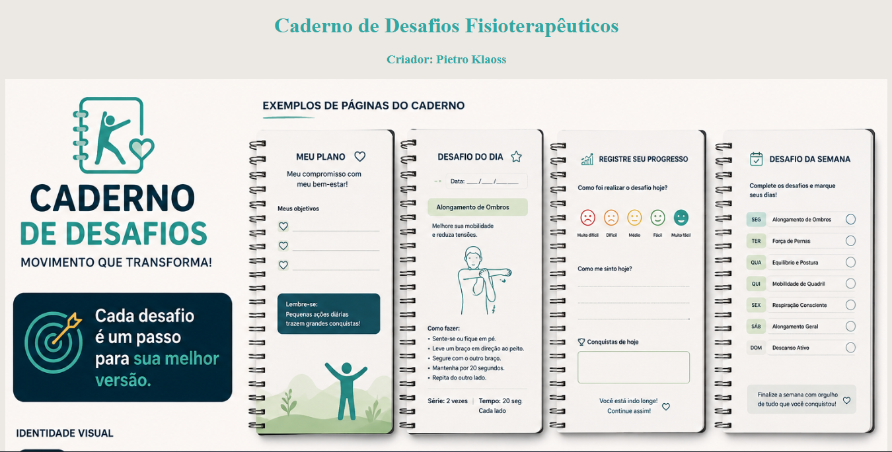

<h1 align="center">💼 Caderno de Desafios Fisioterapêuticos</h1>

<p align="center">


</p>

<p align="center">
Projeto desenvolvido utilizando HTML5 e CSS3 como parte da disciplina de Empreendedorismo, com foco na criação de um site para apresentar uma ideia de negócio de forma organizada e atrativa.
</p>

---

## 📸 Preview



---

## 🎯 Objetivo

Desenvolver um website moderno para apresentar uma proposta de empreendedorismo, colocando em prática conceitos de desenvolvimento web, organização visual e experiência do usuário.

---

## 📖 Sobre

Este projeto foi desenvolvido durante a disciplina de Empreendedorismo com o objetivo de criar uma página web capaz de apresentar uma ideia de negócio de forma clara e profissional.

O desenvolvimento do site permitiu aplicar conhecimentos de HTML e CSS, além de aprimorar a organização de arquivos, a estrutura das páginas e o design da interface.

---

## ✨ Funcionalidades

* 🏠 Página inicial
* 📖 Apresentação da proposta
* 🎨 Interface organizada e intuitiva
* 📱 Navegação simples entre as seções
* 💻 Layout desenvolvido com HTML e CSS

---

## 🛠️ Tecnologias utilizadas

* HTML5
* CSS3

---

## 📂 Estrutura do projeto

```text
assets/
index.html
style.css
README.md
image.png
```

---

## 🚀 Como executar

1. Clone ou baixe este repositório.
2. Abra o arquivo `index.html` em qualquer navegador.

---

## 📚 O que aprendi

Durante este projeto pratiquei:

* Estruturação de páginas HTML
* Estilização com CSS
* Organização de arquivos
* Planejamento de interfaces
* Desenvolvimento de layouts para apresentação de projetos

---

## 👨‍💻 Autor

**Pietro Klaoss Neumann**

Estudante de Engenharia de Software.

GitHub:
https://github.com/pietroneumann

---

⭐ Este projeto faz parte do meu portfólio de estudos em Desenvolvimento Web.
